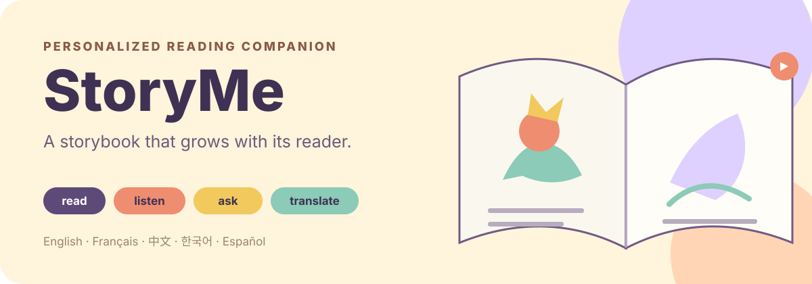

<p align="center">
  
</p>

<p align="center">
  <a href="https://ai.studio/apps/bc984f46-9a43-46eb-a557-900dd22901da"><strong>在 Google AI Studio 中打开</strong></a>
</p>

<p align="center"><a href="./README.md">English</a> · <strong>中文</strong></p>

给孩子找一本难度刚好、又正好是他感兴趣的书，基本靠运气。StoryMe 直接生成一本——配插图、有朗读，而且难度是先测过再匹配的。

```bash
git clone https://github.com/shenjiayi692-maker/storyme && cd storyme && cp .env.example .env.local && npm i && npm run dev
```

它会起来并告诉你要填哪个 key；生成功能需要 Gemini API key。

StoryMe 是一个面向儿童的互动阅读伙伴。它先估计读者的阅读水平，让孩子挑选角色、地点、活动和价值观，然后生成一个五页的故事，配上插图、朗读、翻译、提问和生词帮助。

## 为这个读者定制的故事

- 阅读水平测试，配有分级词表
- 引导式的故事选择：角色、地点、活动、价值观
- 五页 AI 生成的故事结构
- 逐页插图和文字转语音朗读
- 翻译，以及词级的释义、例句和发音
- 一个故事助手，回答简单的追问
- 可导入 PDF、DOCX 或 TXT，最多 500 词
- 界面支持英语、法语、中文、韩语、西班牙语
- 可选的 Firebase 登录、书架收藏、阅读历史和跨设备进度

## 本地运行

前置条件：Node.js、一个 Gemini API key，以及项目已预期的 Firebase 配置。

```bash
cp .env.example .env.local
npm install
npm run dev
```

在 `.env.local` 里设置 `GEMINI_API_KEY`。验证改动：

```bash
npm run lint
npm run build
```

## 故事流程

```text
阅读水平测试 → 挑选故事元素 → 生成五页
            → 配图 + 朗读 → 阅读、提问、翻译、回看
```

Gemini 负责结构化的故事文本、每页的配图提示、翻译、提问、图像、语音和生词支持。Firebase 的 Auth、Firestore 和 Storage 支撑账号与已保存的故事资源；未登录用户在界面允许的范围内仍可使用本地体验。

## 主要模块

| 路径 | 职责 |
| --- | --- |
| [`src/App.tsx`](./src/App.tsx) | 阅读水平评估、创作流程、阅读器、书架，以及持久化编排 |
| [`src/services/gemini.ts`](./src/services/gemini.ts) | 故事、图像、语音、助手和词汇生成 |
| [`src/services/fileParser.ts`](./src/services/fileParser.ts) | PDF 和 DOCX 抽取，含输入截断 |
| [`src/services/authService.ts`](./src/services/authService.ts) | 邮箱与 Google 登录，以及读者档案 |
| [`src/services/storageService.ts`](./src/services/storageService.ts) | 生成的图像与音频存储 |
| [`src/translations.ts`](./src/translations.ts) | 五种语言的界面文案 |

## 安全与产品边界

StoryMe 是一个原型，不是一套有人监督的识字课程。生成的故事、翻译、释义、图像、朗读和阅读水平估计都可能出错或不合适。家长、老师或看护者应在孩子使用前先行审阅生成的材料。

公开部署之前必须复核 Firebase 的规则和配额。不要暴露不受限制的生成或存储端点，也不要把当前的阅读水平交互当作临床或教育评估。

## 许可

MIT,见 [LICENSE](./LICENSE)。
